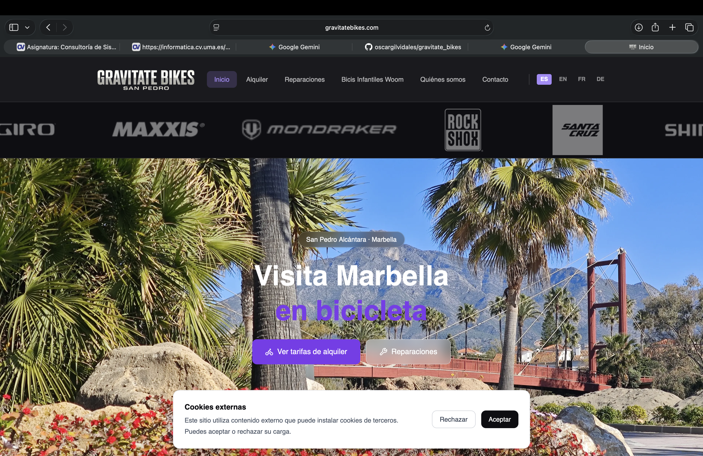

# Gravitate Bikes

> Pagina web para un comercio de alquiler, reparación y venta de bicis.



## Descripcion

Sitio web de **Gravitate Bikes**, con informacion sobre alquiler de bicicletas, reparaciones y otros servicios en San Pedro Alcántara.

## Funcionalidades

- Catálogo de bicis en alquiler.
- Catálogo de reparaciones con detalles del servicio.
- Seccion de bicicletas Woom.
- Paginas de contenido legal y privacidad.
- Sitio preparado para contenido localizado por idioma.

## Tecnologias

- [Next.js](https://nextjs.org/)
- [React](https://react.dev/)
- [TypeScript](https://www.typescriptlang.org/)
- [Tailwind CSS](https://tailwindcss.com/)
- Material UI y Radix UI

## Requisitos

- Node.js [version requerida]
- npm

## Instalacion y desarrollo

```bash
git clone [URL_DEL_REPOSITORIO]
cd gravitate-bikes
npm install
npm run dev
```

Abre [http://localhost:3000](http://localhost:3000) para ver el sitio en el navegador.

## Scripts disponibles

| Comando | Descripcion |
| --- | --- |
| `npm run dev` | Inicia el servidor de desarrollo. |
| `npm run build` | Genera la version de produccion. |
| `npm run start` | Inicia la aplicacion compilada. |
| `npm run lint` | Ejecuta el comando de lint configurado en el proyecto. |

## Estructura del proyecto

```text
.
├── app/                          Rutas de Next.js
│   ├── [lang]/                   Rutas localizadas
│   │   ├── alquiler/
│   │   ├── contacto/
│   │   ├── privacidad/
│   │   ├── quienes-somos/
│   │   ├── reparaciones/
│   │   ├── woom/
│   │   ├── layout.tsx
│   │   └── page.tsx
│   └── page.tsx
├── public/                       Imagenes y archivos estaticos
│   ├── about/
│   ├── bikes/
│   ├── carrusel/
│   ├── dondeEstamos/
│   ├── home/
│   └── woom/
├── readme/
│   └── img/                      Imagenes para este README
├── src/
│   ├── app/
│   │   ├── components/           Componentes reutilizables y UI
│   │   └── pages/                Contenido de las paginas
│   ├── i18n/                     Diccionarios y utilidades de idioma
│   └── styles/                   Estilos globales y del tema
├── next.config.ts
├── package.json
├── postcss.config.mjs
├── tailwind.config.ts
└── tsconfig.json
```

## Despliegue

La aplicacion puede desplegarse en una plataforma compatible con Next.js, como [Vercel](https://vercel.com/).

1. Importa el repositorio en la plataforma elegida.
2. Configura las variables de entorno necesarias: [indicar variables o escribir "Ninguna"].
3. Ejecuta el despliegue usando `npm run build`.

URL de produccion: [URL_DEL_SITIO]

## Contribuciones

<!-- Describe aqui como proponer cambios o reportar errores. -->

1. Crea una rama para tus cambios.
2. Realiza y prueba los cambios.
3. Abre un pull request con una descripcion clara.